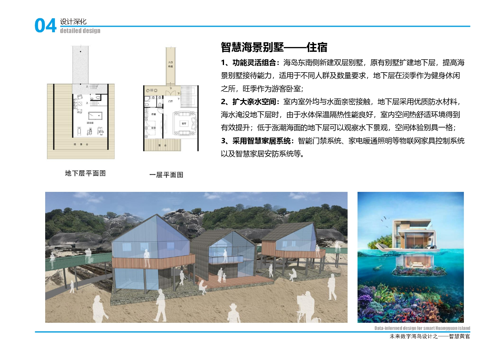
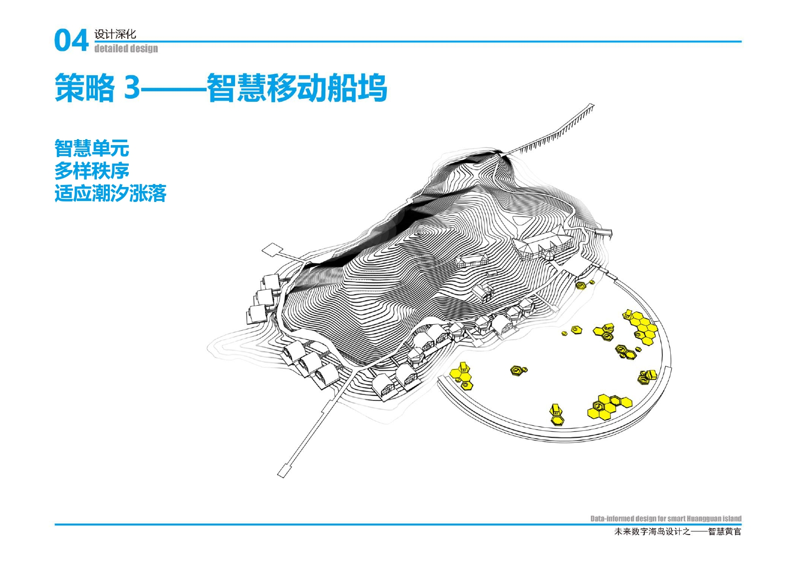
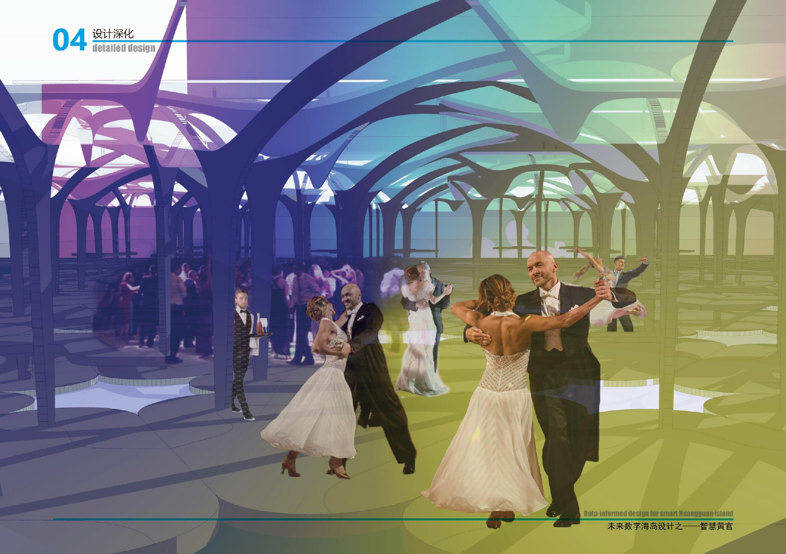
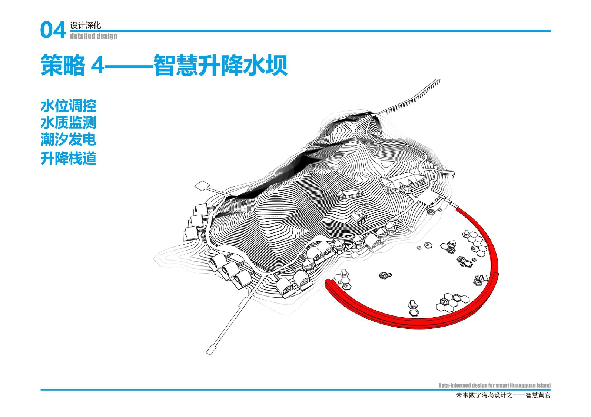

# 研究型设计——未来数字海岛

> 第二届大数据支持空间规划与设计竞赛工作坊

[TOC]

## 设计场地
黄官岛位于福建省福清湾内，东经119°32′，北纬25°37′。全岛长310米，宽150米，海岸线长940米，总面积0.050777平方公里，近岸水深1.5-2米，最高点海拔面积30.18米。

## 环境分析
本次设计为研究型设计，通过对气候数据中平均最高最低气温、云层覆盖率、日出日落时间、日降水概率、潮湿舒适度、平均小时温度、风速、风向、平均风速、平均月降水量等数据进行分析，可以综合判断气候特点。该地区最佳的旅游时间为10月份，最佳的亲水季节为9月份。

通过上述分析，我们可以对海岛的设计做出一些初步的判断：
1. 空间有限，坡度陡，以外向型开发为主；
2. 生态脆弱，易受损，以环境保护修复为主；
3. 潮汐涨落，变化大，以提升亲水性为主；
4. 离岛特性，高科技，以提升生活娱乐品质为主。

## 设计策略

在设计中，我们需要考虑如何打造黄官岛的特色？数字技术应该扮演怎样的角色？在“SMARTCROWN”未来数字海岛的设计中，数字技术除了要解决基本的生存需求，还要能创造更美好的生活体验。我们采用了四个设计策略：
- 策略一：环岛智慧步道；
- 策略二：智慧海景别墅；
- 策略三：智慧移动船坞；
- 策略四：智慧升降水坝。

这四个策略从内到外，逐步扩展，全方位的将黄官岛打造成一个依托数字科技的智慧海岛。

本次设计贯彻了从数字分析出发导出方案的设计思路，在设计中我们采用了无人机飞行收集图片数据，网页查询收集气候以及潮汐数据，手机APP收集海拔高度等实时数据；通过空间句法的VGA分析收集隐藏的空间逻辑数据。

在设计的成果中，也采用了一系列现成的智慧技术，比如在智慧水坝中采用了水位控制、水质监测、潮汐发电、升降栈道等一系列技术、在智慧环岛步道中采用了智能手环、运动路灯、智慧座椅等技术……一系列已经投入使用的数字技术让方案的落实有了更多的保障。

我们希望在黄官岛未来的发展过程中，能够逐步实现数字化，打造出属于自己、面向未来的独特性。同时为生态环境保护作出贡献……

## 成果展示

[最终汇报文件](./smartcrown/ppt-Final.pdf)
[获奖证明](./smartcrown/证书电子版.pdf)