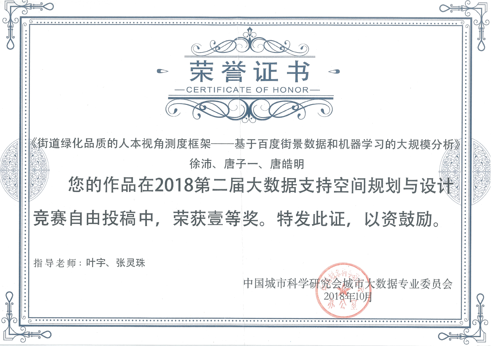

# 街道绿化品质的人本视角测度框架

国城市科学研究会于2018年暑假举办第二届大数据支持空间规划与设计竞赛，竞赛分线上和线下两部分，线下部分，本人在叶宇老师，张灵珠老师的指导下，与唐子一，唐皓明同学一起，完成投稿。

新技术条件下测度街道绿化品质，实现人眼视角绿化可见度与街道可达性的整合分析。抓取上海的大规模街景数据，基于机器学习算法提取绿化可见度，将其与基于空间网络分析的街道可达性开展叠合分析，并与基于卫星遥感影像的绿化率比较，发现绿化率难以准确展现市民日常生活中绿化接触度。运用新技术和新数据推动精细化规划导控，实践上能实现大规模分析并保证高精度结果，理论上能为规划政策的人本视角转型提供支撑。

该投稿基于叶宇老师曾经发表的一篇论文《街道绿化品质的人本视角测度框架——基于百度街景数据和机器学习的大规模分析》，本人有幸参与部分数据收集、处理、标记以及后期出图工作，并最终整理成参赛文件。

[汇报文件](./greenstreet/PPT-final.pdf)
[证书](./greenstreet/奖状.pdf)