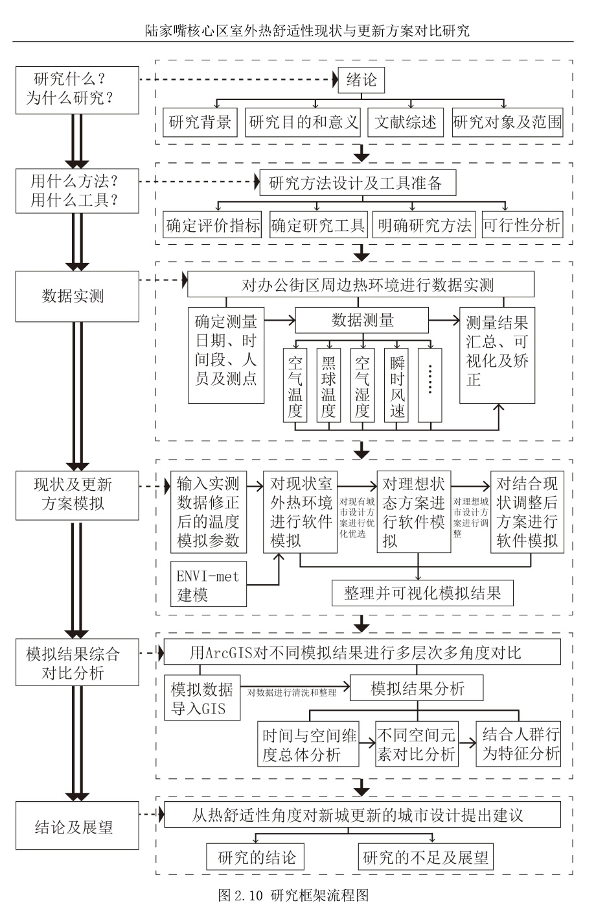

# 上海陆家嘴核心区现状与更新方案室外热环境比较研究


``` admonish note
**Comparative Study on the Current Situation and Renewal Scheme of Outdoor Thermal Comfort
—— A case in the Core Area of Lujiazui**

```


点击查看 [「论文原文」](./paper1/paper1.pdf)


[TOC]


## 中文摘要

> 中国改革开放以来的新城建设规模宏大，发展迅速，但也存在活力不足，人 性化程度不够等问题，面临着空间环境品质提升与更新的需要。热环境和热舒适 性是影响空间环境品质的重要因素，是本研究关注的重点。  
上海陆家嘴地区作为新城建设的标志性案例，也存在上述问题，是一个典型 的研究对象。本文以 XX 大学近几年在陆家嘴地区开展的城市更新的阶段性成果 为基础，采用实地测量和软件模拟的手段，分析比较城市现状与更新方案的公共 空间热环境品质的变化。在对两者的热环境品质做出总体评价的同时，对步行空 间、典型地块等关键要素和节点进行深入评价和比较，探讨传统城市设计方法在 新城更新中对公共空间热环境的影响，为新城更新城市设计方案的评估和预测提 供一个有益的视角和一套分析的方法。  
本研究主要有以下发现，第一，以增加低层高密度建筑为主要手段的新城更 新方案与现状相比，总体热环境没有大的变化，但是对街道步行空间等局部热环 境品质的提升有积极影响;第二，以组团形式组织低层高密度街区，比仅仅增加 单排沿街建筑更有利于改善步行系统的热环境，且街区内部步行系统的热环境要 优于沿街部分，南北向步行空间的热环境要优于东西向步行空间;第三，大规模 的集中绿地对于自身和周边热环境品质的提升都有积极的意义。

## 关键词

新城更新，陆家嘴，城市微环境，热环境品质，软件模拟

## ABSTRACT
> The rapid urban development in China over the past three or four decades are unprecedented. Increasing number of new towns and new districts often show homogeneous urban landscapes that tend to be out of scale, which resulted in impacts to the environmental quality and human comfort. New policies and strategies of urban redevelopment are needed for addressing the above issues.  
Urban outdoor thermal environment plays an important role in defining urban quality of life. Changes in urban form lead to changes in urban micro-climate environment. What urban form would perform better to provide a climate sensitive outdoor environment? An urban design experiment was conducted for redeveloping Shanghai’s Lujiazui, a typical urban development of new district in China. This paper benchmarks existing Lujiazui urban form with alternative design scenarios by measuring urban form and their relation to urban climate effects using an outdoor thermal comfort measure Physiological Equivalent Temperature (PET).  
The results provide findings that the thermal comfort of Lujiazui’s walking environment can be improved by keeping the concentrated green space and increasing the low-rise-high-density buildings. It is more obvious to improve the thermal comfort of walking system by adding low-rise-high-density buildings in the form of group than only adding a single row. This paper provides an effective analysis framework for urban micro-climate environment research with data measurement and software simulation.

## Key Words

urban renewal; urban micro-environment;outdoor thermal comfort; modeling simulation;comparative study


## 研究框架

<div align = center>

</div>

## 研究结论

1. 仅从数值大小上评价三个模拟方案的热环境，无论是从总体空间上、总 体时间上还是典型时间段，差别都不大，但是在空间分布上有差别。可以认为新 城更新中，以增加低层高密度建筑为主要手段的设计方法，对整体热环境影响不 大，但是对改善局部微环境有积极的作用。
原因推论:整体热环境受到更大范围的城市状态的影响，所以在大环境保持 不变的同时，整体热环境也会相对稳定。但是局部空间的热环境会受到周边城市 形态的影响，改变局部的城市形态，就可以改变局部的城市热环境。
2. 从整体空间和步行系统来看，增加低层高密度建筑的同时保留绿地的新 城更新方案，对于热环境的改善效果最好。集中绿地对于提升自身和周边区域的 热环境品质都有积极的作用。
原因推论:增加低层高密度建筑以后，界面变化了，街峡空间也变化了。建 筑之间的相互遮挡减少了太阳的直接辐射，改善了热环境。虽然大面积的集中绿 地受到一些城市设计师的质疑，但是从热环境改善的角度来讲，还是有必要保留 面积较大的绿地。
3. 天空可见度较小的区域，夏季正午的热环境品质往往越好。此结论在步 行系统部分较为明显，在车行系统部分较弱。
原因推论:天空可见度小有两种原因，一种是种植大量乔木，使得人行高度 的天空可见度降低，树冠对热辐射的水平遮挡较强，树木的蒸腾作用也会带走周 围环境的空气中不少的热量。另一种是建筑密度大，道路狭窄，建筑墙体对热辐 射的侧面遮挡比较强。
4. 以组团形式组织低层高密度街区，比仅仅增加单排沿街建筑更有利于改 善步行系统的热环境。且街区内部步行系统的热舒适性要优于沿街部分，南北向 步行系统的热舒适要优于东西向。
原因推论:这也和日照较大关系，街区周边无建筑遮挡时，西南方向受到太 阳的辐射较强，所以热舒适较差。当增加了一定量的低层高密度建筑后，有了建筑遮挡，街区内部步行系统的热环境得到了改善，沿街部分暴露在太阳辐射中，
所以热环境相对就会较差。

